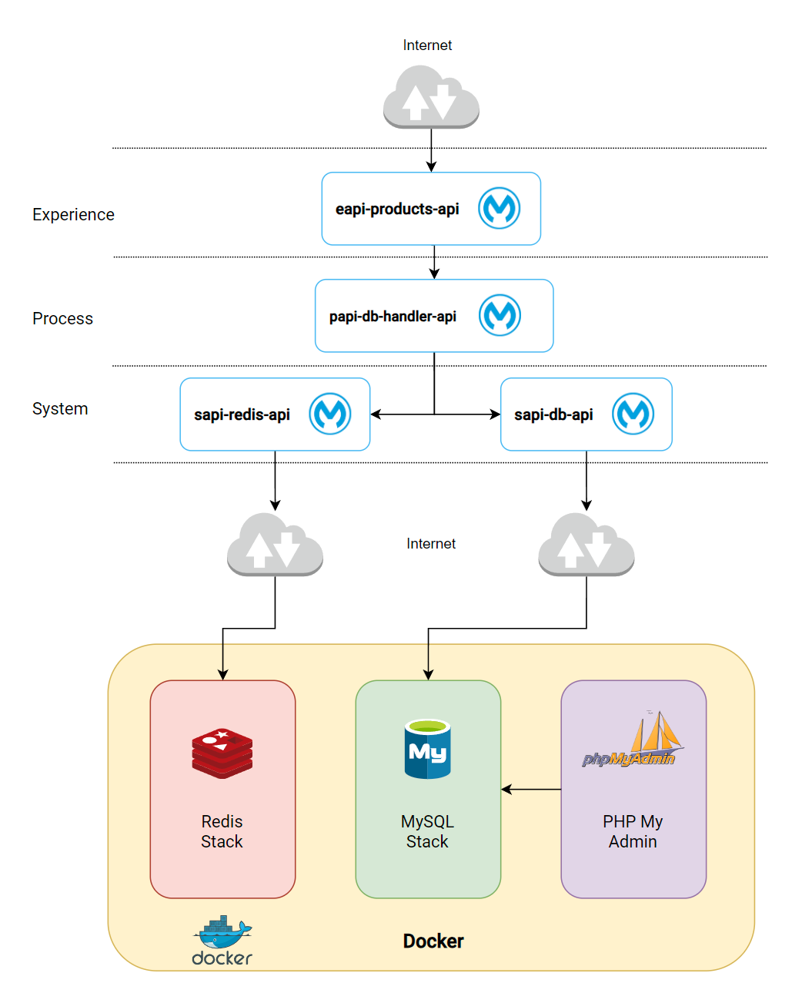

# Database Caching Demo 

 The full demo is deployed in Anypoint Platform and can be accessed using a ClientId and Client Secret. 

It can also be deployed in local with Docker. 

## Components 

- Mule Runtime 4.8 
- Docker 4.34.4 
- MySQL Docker Image 
- PHP MyAdmin Docker Image 
- Redis Server Stack Docker Image 

## Architecture

The environment is all bound in the same network by a docker compose file, so it makes it easier to test. 

When deployed in CloudHub 2.0 only the two databases are hosted in Docker so you will need to expose the correct ports out of your router. 



## Local Deployment 

To be able to deploy the project locally follow the next steps. Keep in mind that these steps have under consideration that you already have docker running on your local machine. 

1. clone the repository
2. Open the docker-compose file
3. Edit the volume binding for the runtime. This is the folder where you will drop the apps
```
/mnt/c/Users/andre/Downloads/MuleSoft STC Exercices/applications 
```
4. Run `cd Stack` and use the command `docker compose up –d`
5. Check that all the containers are running, and you can connect to the databases 
    - MySQL: `mysql –h 127.0.0.1 -P 3011 –u mule –p soft`
    - Redis: `redis-cli –h localhost –p 6379`. Once inside run `AUTH redis_pass`
    - My Admin: `http://localhost:9999` and use the following params
        - User: `mule`
        - Password: `soft`
        - Server: `mysql-stack:3306`

6. Deploy your applications by dropping the JAR files in the bound directory. The runtime is configured to use the property mule.env set as docker that will make the applications run in the following ports:
    - EAPI: 2310
    - PAPI: 2311
    - SAPI MySQL: 2312
    - SAPI Redis: 2313

7. If everything goes correctly you can now test the full project using the Postman Collection.

**Note:** For the sake of easy replication, the EAPI is not using API Auto discovery
**Note 2:** The Postman Collection has the Cloudhub 2.0 and the localhost endpoints. Use the corresponding one.
